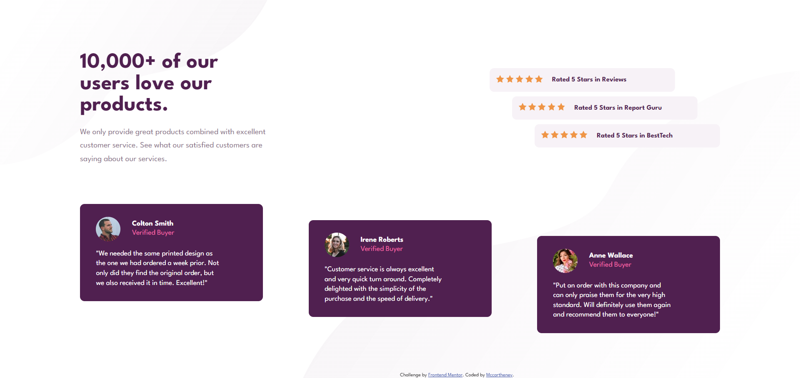
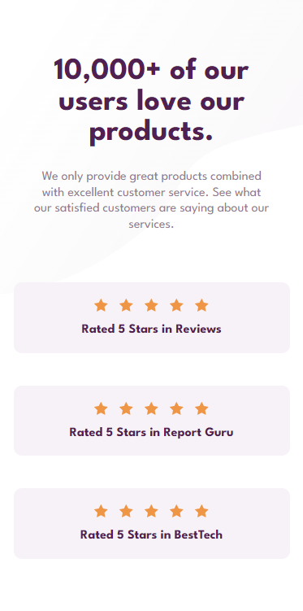
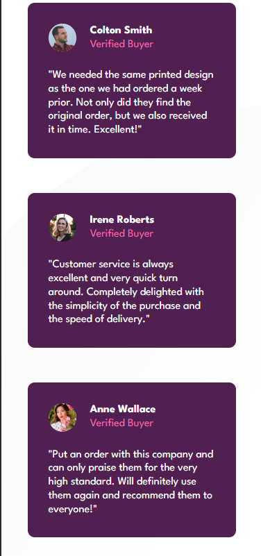

## Table of contents

- [Overview](#overview)
  - [The challenge](#the-challenge)
  - [Screenshot](#screenshot)
  - [Links](#links)
- [My process](#my-process)
  - [Built with](#built-with)
- [Author](#author)

## Overview

### The challenge

Users should be able to:

- View the optimal layout for the section depending on their device's screen size

### Screenshot

### Links

- Live Site URL: [Live site](https://candid-lamington-e93dca.netlify.app/)

## My process

### Built with

- HTML5
- CSS 
- Flexbox
- CSS Grid

## Author

- linkedIn - [Mccartheney Mendes](https://www.linkedin.com/in/mccartheney-mendes-892709292/)
- github - [Mccartheney Mendes](https://github.com/mccartheney)
- Frontend Mentor - [@mccartheney](https://www.frontendmentor.io/profile/mccartheney)